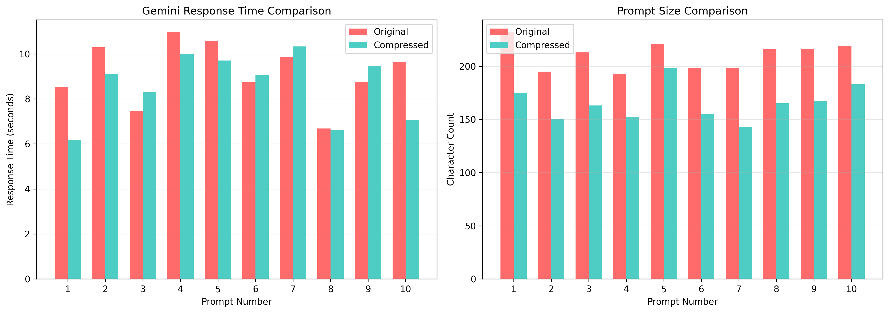

# Bear-1 Compression Benchmark Report

## Summary Statistics

| Metric | Value |
|--------|-------|
| **Prompts Tested** | 10 |
| **Avg Compression Ratio** | 78.5% |
| **Avg Time Saved** | 0.57s |
| **Total Characters Saved** | 450 |



---

## Detailed Results

### Prompt 1

**Original:** Explain quantum entanglement and its implications for quantum computing, including how qubits can be...

**Compressed:**  Explain quantum entanglement implications for quantum computing, including qubits entangled propert...

| Metric | Original | Compressed | Change |
|--------|----------|------------|--------|
| Characters | 232 | 175 | 75.4% |
| Response Time | 8.53s | 6.19s | +27.5% |

<details>
<summary>View Full Responses</summary>

**Original Response:**
```
## Quantum Entanglement: The Spooky Connection

Quantum entanglement is one of the most counter-intuitive and profound phenomena in quantum mechanics. It describes a unique link shared by two or more quantum particles (such as electrons or photons), where their fates become intertwined, regardless o...
```

**Compressed Response:**
```
Quantum entanglement is one of the most profound and counter-intuitive phenomena in physics, and it is absolutely central to the power of quantum computing.

Here is an explanation of quantum entanglement, its implications for quantum computing, and how the entangled property of qubits enables quant...
```

</details>

---

### Prompt 2

**Original:** Describe the complete process of protein synthesis in eukaryotic cells, from DNA transcription in th...

**Compressed:**  complete process protein synthesis eukaryotic cells DNA transcription nucleus mRNA processing ribos...

| Metric | Original | Compressed | Change |
|--------|----------|------------|--------|
| Characters | 195 | 150 | 76.9% |
| Response Time | 10.29s | 9.12s | +11.5% |

<details>
<summary>View Full Responses</summary>

**Original Response:**
```
Protein synthesis, or gene expression, is a fundamental biological process by which the genetic information encoded in DNA is converted into a functional protein. In eukaryotic cells, this complex process is spatially and temporally separated, beginning in the nucleus and concluding in the cytoplasm...
```

**Compressed Response:**
```
The process of protein synthesis in eukaryotic cells is a highly regulated, complex, and energy-intensive process that occurs primarily in two stages: gene expression (transcription and processing) in the nucleus, followed by translation in the cytoplasm.

Here is a comprehensive breakdown of the co...
```

</details>

---

### Prompt 3

**Original:** What are the key differences between supervised, unsupervised, and reinforcement learning in machine...

**Compressed:**  key differences between supervised, unsupervised, reinforcement learning machine learning? Provide ...

| Metric | Original | Compressed | Change |
|--------|----------|------------|--------|
| Characters | 213 | 163 | 76.5% |
| Response Time | 7.45s | 8.29s | -11.3% |

<details>
<summary>View Full Responses</summary>

**Original Response:**
```
The three primary categories of machine learning—**Supervised**, **Unsupervised**, and **Reinforcement Learning**—differ fundamentally in how they interact with data, the types of problems they solve, and the goals they aim to achieve.

Here is a detailed breakdown of the key differences, use cases,...
```

**Compressed Response:**
```
The three main categories of machine learning—**Supervised Learning, Unsupervised Learning, and Reinforcement Learning**—differ fundamentally in how they interact with data and how they learn to make predictions or decisions.

Here is a detailed breakdown of the key differences, along with examples ...
```

</details>

---

### Prompt 4

**Original:** Analyze the causes and consequences of the 2008 financial crisis, including the role of subprime mor...

**Compressed:**  Analyze causes consequences 2008 financial crisis, including role subprime mortgages, credit defaul...

| Metric | Original | Compressed | Change |
|--------|----------|------------|--------|
| Characters | 193 | 152 | 78.8% |
| Response Time | 10.97s | 10.00s | +8.8% |

<details>
<summary>View Full Responses</summary>

**Original Response:**
```
## The 2008 Financial Crisis: Causes, Mechanisms, and Global Consequences

The financial crisis of 2007–2009, often referred to simply as the **2008 financial crisis** or the **Great Recession**, was the most severe global economic downturn since the Great Depression. It originated in the U.S. housi...
```

**Compressed Response:**
```
The 2008 financial crisis, often referred to as the Global Financial Crisis (GFC), was the most severe financial calamity since the Great Depression. Its causes were complex and interconnected, revolving around lax lending standards, opaque financial instruments, and systemic regulatory failures. Th...
```

</details>

---

### Prompt 5

**Original:** Explain how blockchain technology works, including consensus mechanisms like Proof of Work and Proof...

**Compressed:**  Explain blockchain technology works, including consensus mechanisms like Proof of Work Proof Stake,...

| Metric | Original | Compressed | Change |
|--------|----------|------------|--------|
| Characters | 221 | 198 | 89.6% |
| Response Time | 10.56s | 9.71s | +8.1% |

<details>
<summary>View Full Responses</summary>

**Original Response:**
```
The advent of blockchain technology, initially conceived as the foundation for cryptocurrencies like Bitcoin, has introduced a revolutionary paradigm for secure, decentralized data management. It fundamentally shifts trust from centralized authorities (like banks or governments) to cryptographic pro...
```

**Compressed Response:**
```
## Understanding Blockchain Technology

Blockchain technology is a revolutionary type of distributed ledger that records transactions across many computers, ensuring that the data is secure, transparent, and tamper-proof. It is the underlying technology that powers cryptocurrencies like Bitcoin, but...
```

</details>

---

### Prompt 6

**Original:** Describe the water cycle in detail, including evaporation, condensation, precipitation, infiltration...

**Compressed:**  Describe water cycle detail, evaporation condensation precipitation infiltration runoff transpirati...

| Metric | Original | Compressed | Change |
|--------|----------|------------|--------|
| Characters | 198 | 155 | 78.3% |
| Response Time | 8.74s | 9.06s | -3.6% |

<details>
<summary>View Full Responses</summary>

**Original Response:**
```
The water cycle, also known as the hydrologic cycle, is the continuous movement of water on, above, and below the surface of the Earth. This cycle is essential for sustaining life and regulating global climate patterns. It involves several interconnected processes driven primarily by solar energy an...
```

**Compressed Response:**
```
The water cycle, also known as the hydrologic cycle, is the continuous movement of water on, above, and below the surface of the Earth. It is essential for sustaining life and regulating global climate.

Here is a detailed description of the water cycle, its key processes, and how climate change is ...
```

</details>

---

### Prompt 7

**Original:** What is the difference between SQL and NoSQL databases? Discuss their respective strengths, weakness...

**Compressed:**  difference between SQL NoSQL databases? Discuss strengths, weaknesses, ideal use cases, considerati...

| Metric | Original | Compressed | Change |
|--------|----------|------------|--------|
| Characters | 198 | 143 | 72.2% |
| Response Time | 9.87s | 10.33s | -4.6% |

<details>
<summary>View Full Responses</summary>

**Original Response:**
```
The fundamental difference between SQL and NoSQL databases lies in their **data models** and **architecture**, which dictates their respective strengths, weaknesses, and suitability for different use cases.

---

## 1. Core Differences: Data Model and Architecture

### SQL Databases (Relational Data...
```

**Compressed Response:**
```
The difference between SQL and NoSQL databases is fundamental, touching upon their architecture, data models, scalability, and consistency approaches. While **SQL (Relational) databases** prioritize structure and ACID compliance, **NoSQL (Non-Relational) databases** prioritize flexibility, availabil...
```

</details>

---

### Prompt 8

**Original:** Explain the concept of neuroplasticity and how the brain reorganizes itself by forming new neural co...

**Compressed:**  Explain concept neuroplasticity brain reorganizes forming new neural connections life. Include exam...

| Metric | Original | Compressed | Change |
|--------|----------|------------|--------|
| Characters | 216 | 165 | 76.4% |
| Response Time | 6.69s | 6.62s | +1.0% |

<details>
<summary>View Full Responses</summary>

**Original Response:**
```
The concept of **neuroplasticity** (also known as brain plasticity or neural plasticity) is one of the most revolutionary findings in modern neuroscience. It fundamentally describes the brain's remarkable ability to reorganize itself—structurally and functionally—by forming new neural connections th...
```

**Compressed Response:**
```
Neuroplasticity is one of the most exciting and fundamental concepts in modern neuroscience. It is the brain's remarkable ability to **reorganize itself**—both structurally and functionally—by forming new neural connections throughout an entire lifespan.

Essentially, the brain is not a fixed, rigid...
```

</details>

---

### Prompt 9

**Original:** Describe the main principles of object-oriented programming including encapsulation, inheritance, po...

**Compressed:**  main principles object-oriented programming encapsulation inheritance polymorphism, abstraction. Pr...

| Metric | Original | Compressed | Change |
|--------|----------|------------|--------|
| Characters | 216 | 167 | 77.3% |
| Response Time | 8.77s | 9.48s | -8.2% |

<details>
<summary>View Full Responses</summary>

**Original Response:**
```
Object-Oriented Programming (OOP) is a programming paradigm that uses "objects" – instances of classes – to design applications and computer programs. It focuses on binding data and the functions that operate on that data into a single unit.

The four main principles (or pillars) of OOP are **Encaps...
```

**Compressed Response:**
```
The core principles of Object-Oriented Programming (OOP) are **Encapsulation, Inheritance, Polymorphism, and Abstraction**. These principles are crucial for creating well-organized, maintainable, and scalable code.

---

## 1. Encapsulation

**Definition:** Encapsulation is the bundling of data (att...
```

</details>

---

### Prompt 10

**Original:** What are the key factors that contribute to climate change? Discuss greenhouse gas emissions, defore...

**Compressed:**  key factors contribute climate change? Discuss greenhouse gas emissions, deforestation, ocean acidi...

| Metric | Original | Compressed | Change |
|--------|----------|------------|--------|
| Characters | 219 | 183 | 83.6% |
| Response Time | 9.64s | 7.04s | +26.9% |

<details>
<summary>View Full Responses</summary>

**Original Response:**
```
The Earth's climate is a complex system influenced by various factors, both natural and human-induced. However, the overwhelming scientific consensus points to human activity as the primary driver of the rapid climate change observed since the Industrial Revolution.

Here is a detailed discussion of...
```

**Compressed Response:**
```
## Key Factors Contributing to Climate Change

Climate change is a complex, multifaceted phenomenon driven by several interconnected factors, with human activities being the dominant cause. Understanding these factors—ranging from atmospheric composition changes to ecosystem alterations—is crucial f...
```

</details>

---

